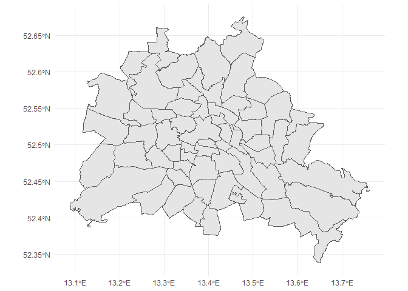
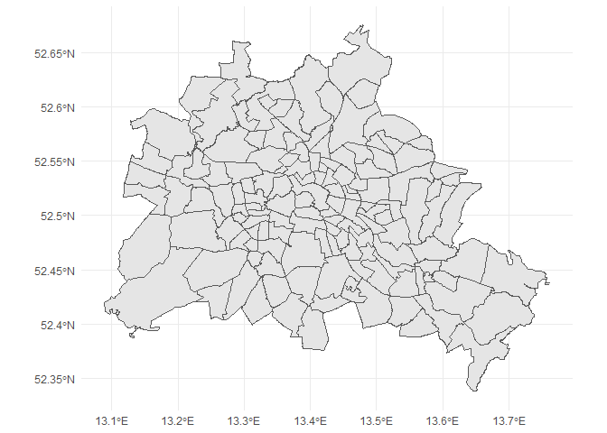
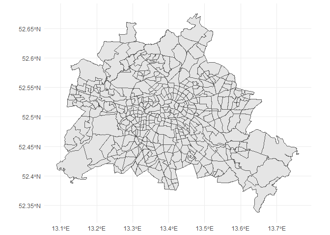
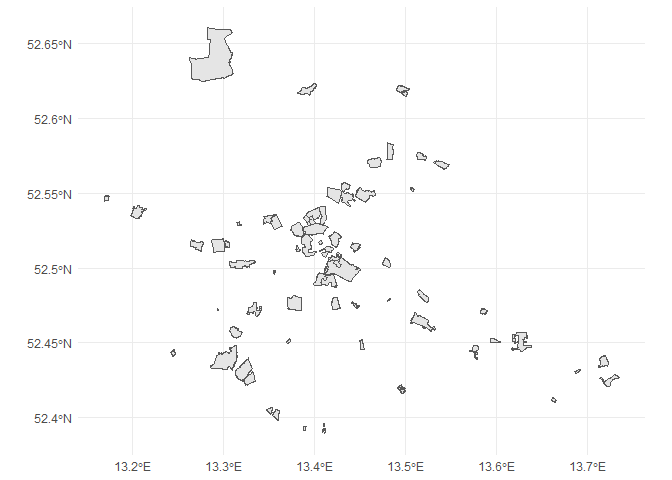

<!-- README.md is generated from README.Rmd. Please edit that file -->

# berlingeo

<!-- badges: start -->

<!-- badges: end -->

This package contains spatial data files for various administrative
boundaries in Berlin, Germany and currently one function `sf_fisbroker`
to convert WKS files from the Berlin Geodata Portal
[“FIS-Broker”](https://www.stadtentwicklung.berlin.de/geoinformation/fis-broker/)
in sf objects. I was motivated by the package
[nycgeo](https://github.com/mfherman/nycgeo) from Matt Herman.

Data Source: Amt für Statistik Berlin-Brandenburg, Data Licence: Lizenz
CC-BY-3.0

## Installation

Development version from GitHub

``` r
remotes::install_github("patperu/berlingeo")
library("berlingeo")
```

``` r

library(berlingeo)
library(sf)
#> Linking to GEOS 3.6.1, GDAL 2.2.3, PROJ 4.9.3
library(tidyverse)
#> -- Attaching packages -------------------------------------------------------------- tidyverse 1.2.1 --
#> v ggplot2 3.2.0.9000     v purrr   0.3.2     
#> v tibble  2.1.3          v dplyr   0.8.3     
#> v tidyr   0.8.3          v stringr 1.4.0     
#> v readr   1.3.1          v forcats 0.4.0
#> -- Conflicts ----------------------------------------------------------------- tidyverse_conflicts() --
#> x dplyr::filter() masks stats::filter()
#> x dplyr::lag()    masks stats::lag()
```

## LOR - Prognoseraum

``` r

glimpse(lor_pgr_sf)
#> Observations: 60
#> Variables: 7
#> $ gml_id     <chr> "s_lor_prog.0101", "s_lor_prog.0102", "s_lor_prog.0...
#> $ RAUMID     <chr> "0101", "0102", "0103", "0104", "0201", "0202", "02...
#> $ PGRNAME    <chr> "Zentrum", "Moabit", "Gesundbrunnen", "Wedding", "K...
#> $ BEZNAME    <chr> "Mitte", "Mitte", "Mitte", "Mitte", "Friedrichshain...
#> $ DATUM      <chr> "2007-10-31T00:00:00", "2007-10-31T00:00:00", "2007...
#> $ SHAPE_AREA <dbl> 15844742, 8239538, 5753252, 9611634, 2929465, 47540...
#> $ geometry   <MULTIPOLYGON [°]> MULTIPOLYGON (((13.36953 52..., MULTIP...

ggplot(lor_pgr_sf) +
  geom_sf() + 
  theme_minimal()
```



## LOR - Bezirksregion

``` r

glimpse(lor_bzr_sf)
#> Observations: 138
#> Variables: 8
#> $ gml_id                <chr> "s_lor_bez.010111", "s_lor_bez.010112", ...
#> $ RAUMID                <chr> "010111", "010112", "010113", "010114", ...
#> $ BEZIRKSREGION         <chr> "Tiergarten Süd", "Regierungsviertel", "...
#> $ PROGNOSERAUM          <chr> "Zentrum", "Zentrum", "Zentrum", "Zentru...
#> $ BEZIRK                <chr> "Mitte", "Mitte", "Mitte", "Mitte", "Mit...
#> $ DATUM_GUELTIG_AB      <chr> "2006-06-14 00:00:00.0", "2006-06-14 00:...
#> $ FLAECHENGROESSE_IN_M2 <dbl> 366755.5, 744742.1, 1685341.1, 1151740.5...
#> $ geometry              <MULTIPOLYGON [°]> MULTIPOLYGON (((13.36953 52...

ggplot(lor_bzr_sf) +
  geom_sf() + 
  theme_minimal()
```



## LOR - Planungsraum

``` r

glimpse(lor_plr_sf)
#> Observations: 448
#> Variables: 9
#> $ gml_id                <chr> "s_lor_plan.01011101", "s_lor_plan.01011...
#> $ RAUMID                <chr> "01011101", "01011102", "01011103", "010...
#> $ PLANUNGSRAUM          <chr> "Stülerstraße", "Großer Tiergarten", "Lü...
#> $ BEZIRKSREGION         <chr> "Tiergarten Süd", "Tiergarten Süd", "Tie...
#> $ PROGNOSERAUM          <chr> "Zentrum", "Zentrum", "Zentrum", "Zentru...
#> $ BEZIRK                <chr> "Mitte", "Mitte", "Mitte", "Mitte", "Mit...
#> $ DATUM_GUELTIG_AB      <chr> "14.06.2006", "14.06.2006", "14.06.2006"...
#> $ FLAECHENGROESSE_IN_M2 <int> 366756, 3009397, 522357, 338383, 934610,...
#> $ geometry              <MULTIPOLYGON [°]> MULTIPOLYGON (((13.33889 52...

ggplot(lor_plr_sf) +
  geom_sf() + 
  theme_minimal()
```



## Convert WKS dataset to a sf (simple features) object

``` r

sf_fisbroker("s_erhaltgeb_es") %>%
  ggplot() +
    geom_sf() + 
    theme_minimal()
#> [1] "http://fbinter.stadt-berlin.de/fb/wfs/data/senstadt/s_erhaltgeb_es?service=wfs&version=2.0.0&request=GetFeature&TYPENAMES=s_erhaltgeb_es"
```



Please note that the ‘berlingeo’ project is released with a [Contributor
Code of Conduct](CODE_OF_CONDUCT.md). By contributing to this project,
you agree to abide by its terms.
